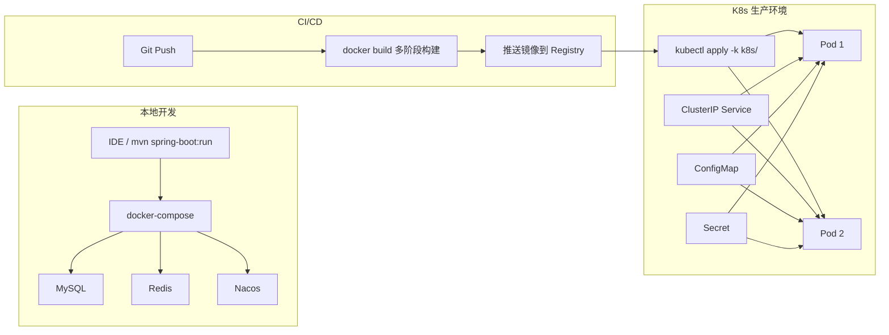
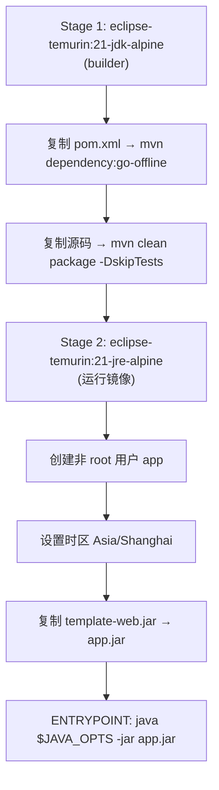
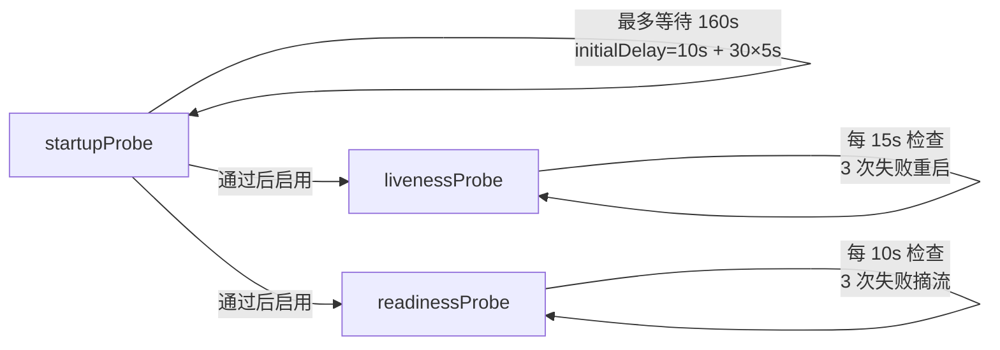
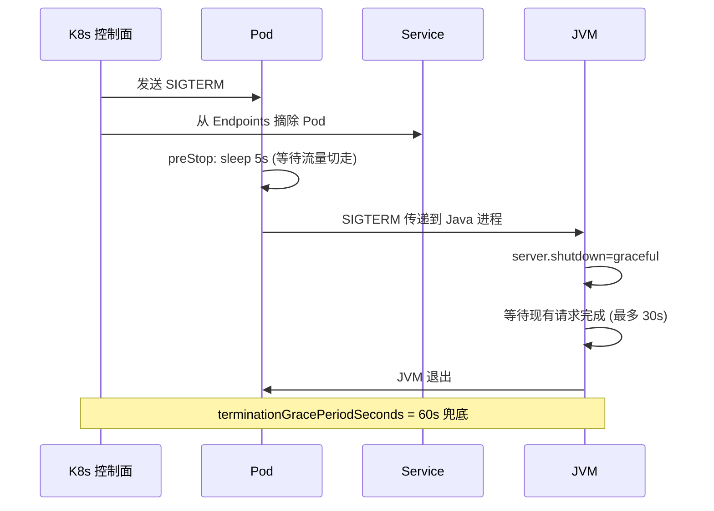
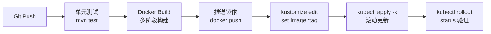

# ProjectTemplate Docker 化全流程分析

基于对项目模板所有配置文件的完整分析，以下是 **开发 → 构建 → 部署 → 运维** 四个阶段的 Docker 化工作流。

---

## 一、整体架构概览



---

## 二、本地开发阶段

### 2.1 启动依赖中间件

```bash
docker-compose up -d mysql redis nacos
```

`docker-compose.yml` 提供三个中间件容器：

| 服务 | 镜像 | 端口映射 | 健康检查 |
|---|---|---|---|
| MySQL 8.0 | `mysql:8.0` | `3306:3306` | `mysqladmin ping` |
| Redis 7 | `redis:7-alpine` | `88881:6379` | `redis-cli ping` |
| Nacos 2.4.3 | `nacos/nacos-server:v2.4.3` | `8848, 9848` | — |

> [!TIP]
> MySQL 使用 `mysql-data` 命名卷持久化数据，重启容器不丢数据。

### 2.2 两种开发方式

**方式 A：IDE 直接启动（推荐日常开发）**

```bash
mvn clean install          # 编译
mvn spring-boot:run -pl template-web  # 启动
```

应用通过 `template-web/src/main/resources/bootstrap.yml` 中的本地默认值连接 docker-compose 中间件：
- JDBC → `localhost:3306`
- Redis → `127.0.0.1:88881`
- Nacos → `127.0.0.1:8848`

**方式 B：全容器化启动（模拟生产环境）**

```bash
docker-compose up -d       # 启动所有服务，包括 app
```

`app` 服务使用 `Dockerfile` 多阶段构建，自动等待 MySQL 和 Redis 健康后才启动。

---

## 三、构建阶段 — 多阶段 Docker 镜像

`Dockerfile` 使用两阶段构建：



### 关键设计决策

| 特性 | 实现方式 | 说明 |
|---|---|---|
| **依赖缓存** | `RUN --mount=type=cache,target=/root/.m2` | Maven 依赖缓存跨构建共享，大幅加速 |
| **安全** | 非 root 用户 `app:app` | 最小权限原则 |
| **轻量** | Alpine 基础 + JRE-only | 镜像体积约 200MB 以内 |
| **JVM 容器感知** | `UseContainerSupport` + `MaxRAMPercentage=75%` | 自动适应 K8s 资源限制 |
| **信号传递** | `exec java ... -jar` | 确保 SIGTERM 直达 JVM，支持优雅停机 |

### 构建命令

```bash
# 标准构建
docker build -t your-registry/template:v1.0.0 .

# 如果在 Apple Silicon Mac 上构建用于 x86 K8s 集群
docker buildx build --platform linux/amd64 -t your-registry/template:v1.0.0 --push .
```

---

## 四、部署阶段 — Kubernetes

项目使用 **Kustomize** 管理 K8s 清单，所有文件在 `k8s/` 目录下。

### 4.1 资源清单一览

| 文件 | 用途 |
|---|---|
| `k8s/deployment.yaml` | 2 副本、滚动更新、三级探针、优雅停机 |
| `k8s/service.yaml` | ClusterIP 内部服务暴露 |
| `k8s/configmap.yaml` | Nacos/MySQL/Redis 连接信息 |
| `k8s/kustomization.yaml` | 资源编排 + 镜像版本管理 |

### 4.2 部署流程

```bash
# 1. 推送镜像
docker push your-registry/template:v1.0.0

# 2. 创建 Secret（通常仅首次或更新密码时执行）
kubectl create secret generic template-secret \
  --from-literal=jdbc-password='YOUR_DB_PASSWORD' \
  --from-literal=redis-password='YOUR_REDIS_PASSWORD' \
  -n default

# 3. 更新镜像版本
cd k8s && kustomize edit set image your-registry.com/template:v1.0.0

# 4. 部署
kubectl apply -k .

# 5. 验证
kubectl rollout status deployment/template
kubectl get pods -l app=template
```

### 4.3 滚动更新策略 — 零停机

```yaml
strategy:
  type: RollingUpdate
  rollingUpdate:
    maxSurge: 1       # 最多多创建 1 个 Pod
    maxUnavailable: 0 # 必须 0 停机
```

更新过程：新 Pod 启动 → 通过就绪探针 → 旧 Pod 执行 preStop sleep 5s → 优雅停机 30s → 完成。

### 4.4 三级健康探针



| 探针 | 端点 | 作用 |
|---|---|---|
| **startupProbe** | `/actuator/health/liveness` | 防止慢启动 Java 应用被杀 |
| **livenessProbe** | `/actuator/health/liveness` | 卡死检测 → 重启 Pod |
| **readinessProbe** | `/actuator/health/readiness` | 未就绪 → 从 Service 摘除流量 |

### 4.5 配置管理 — 两层分离

| 类型 | 来源 | 示例 |
|---|---|---|
| **非敏感配置** | ConfigMap `template-config` | Nacos 地址、JDBC URL、Redis Host |
| **敏感凭据** | Secret `template-secret` | 数据库密码、Redis 密码 |

应用通过 `envFrom` 和 `env[].valueFrom.secretKeyRef` 注入，无需硬编码。

---

## 五、运维阶段

### 5.1 优雅停机链路



### 5.2 资源限制

```yaml
resources:
  requests:     # 调度保证
    cpu: 250m
    memory: 512Mi
  limits:       # 硬上限
    cpu: 1000m
    memory: 1024Mi
```

JVM 通过 `MaxRAMPercentage=75%` 自动感知容器内存限制（1024Mi × 75% ≈ 768Mi 堆内存）。

### 5.3 监控端点

| 端点 | 用途 |
|---|---|
| `/actuator/health` | 整体健康状态 |
| `/actuator/health/liveness` | K8s 存活探针 |
| `/actuator/health/readiness` | K8s 就绪探针 |
| `/actuator/prometheus` | Prometheus 指标采集（JVM/线程/HTTP 等） |

### 5.4 安全加固

- Docker 镜像以 `app` 非 root 用户运行
- K8s Deployment 设置 `runAsNonRoot: true, runAsUser: 1000`
- 数据库/Redis 密码通过 K8s Secret 注入，不进代码仓库

---

## 六、典型 CI/CD Pipeline 参考

虽然项目模板未包含 CI 配置，但基于现有结构，典型流水线如下：



```bash
# CI/CD 脚本骨架
VERSION=$(git describe --tags --always)

# 1. 测试
mvn clean test

# 2. 构建 & 推送
docker build -t your-registry/template:${VERSION} .
docker push your-registry/template:${VERSION}

# 3. 部署
cd k8s
kustomize edit set image your-registry.com/template=${VERSION}
kubectl apply -k .
kubectl rollout status deployment/template --timeout=300s
```

---

## 七、当前模板的完善度评估

| 维度 | 状态 | 说明 |
|---|---|---|
| ✅ 多阶段 Docker 构建 | **完善** | 依赖缓存、非 root、轻量镜像 |
| ✅ 本地开发 docker-compose | **完善** | MySQL/Redis/Nacos + 应用 |
| ✅ K8s Deployment | **完善** | 滚动更新、三级探针、优雅停机 |
| ✅ 配置/密钥分离 | **完善** | ConfigMap + Secret |
| ✅ 监控端点 | **完善** | Prometheus + Health Probes |
| ⚠️ CI/CD Pipeline | **缺少** | 未包含 Jenkinsfile / GitHub Actions |
| ⚠️ Ingress / Gateway | **缺少** | 需根据实际集群补充 |
| ⚠️ HPA 自动扩缩容 | **缺少** | 可按需添加 `HorizontalPodAutoscaler` |
| ⚠️ NetworkPolicy | **缺少** | 生产建议添加网络隔离策略 |
| ⚠️ PodDisruptionBudget | **缺少** | 生产建议确保最少可用副本数 |
